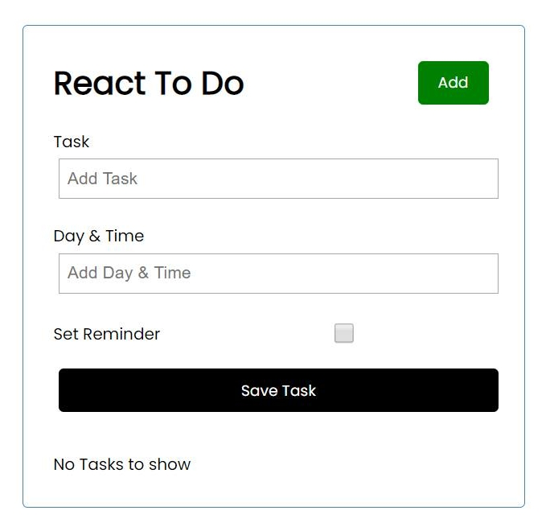
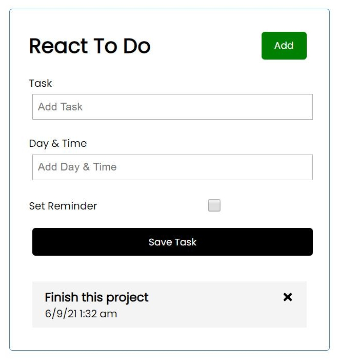
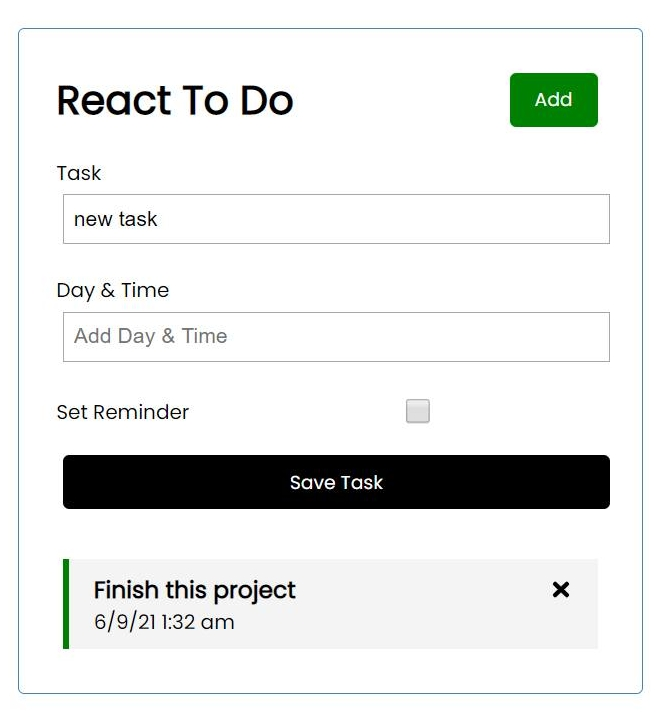
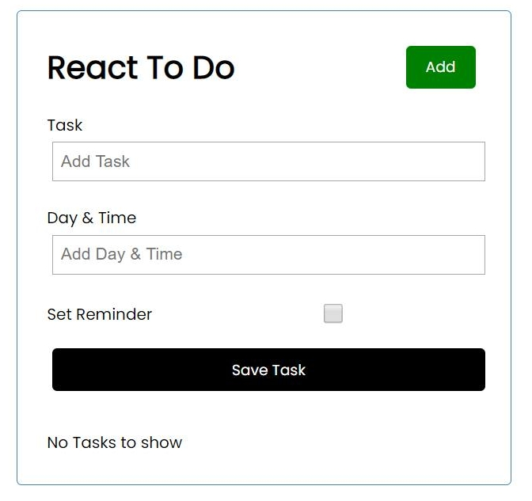
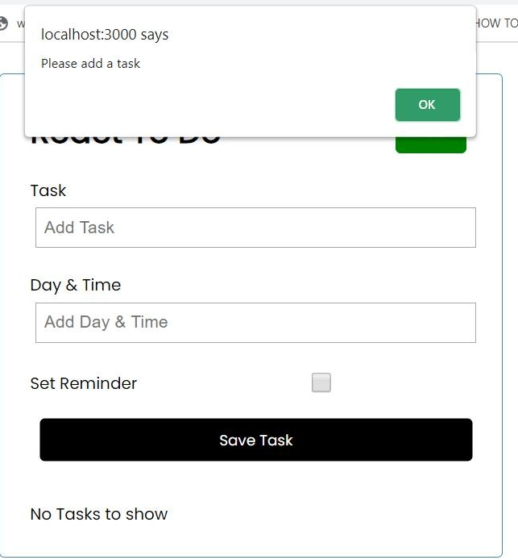

# React To Do

# About

This project is essentially is a to do list

The user can add tasks by typing in the name of the task and the date and time they want to accomplish it

The user can also delete the task just by simply clicking on the 'x' in the list

If the user wants to prioritize a specific task they can simply double click on a task to toggle it. The user can also click on "set reminder" when they are adding a task onto the list.

If the user does not enter anything but clicks on submit they will recieve a message asking them to add a task.

# Documentation
This project was built using React.JS 

HTML is used for the title of the project while CSS is used for the overal design of the To Do List

The functionality of the To Do List is built using React Props, React Hooks, and JavaScript.

To run the application the user must type in npm start in the terminal.

# Result when the user starts the application

# Result when the user adds a task 

# Result when the user adds a task with the reminder clicked

# Result when the user deletes a task

# Result when the user presses submit without adding any task
 
